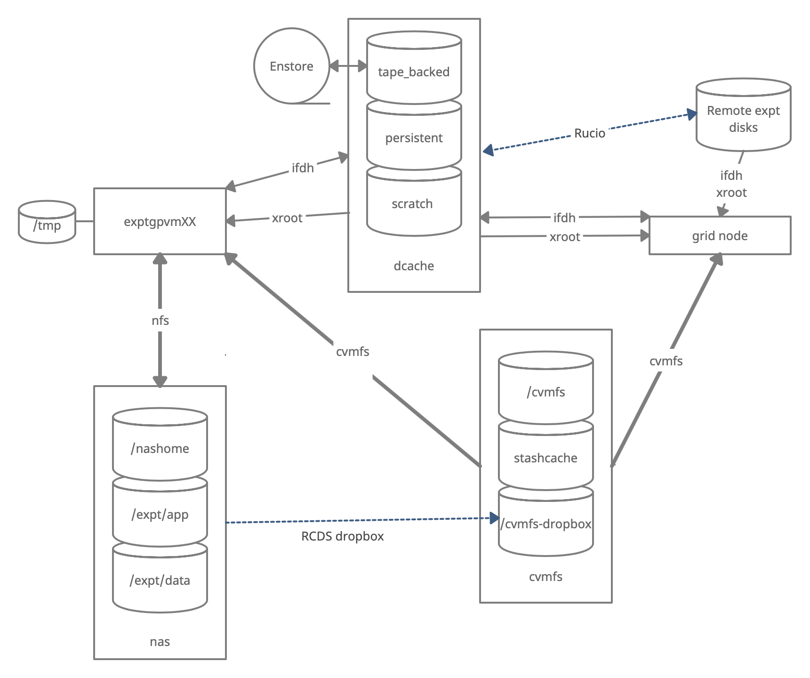

## Session Video

<!--The session will be captured on video a placed here after the workshop for asynchronous study.-->

The session video from the training in January 2023 is provided here as a reference.

<iframe width="560" height="315" src="https://www.youtube.com/embed/xa6m7EVGiIM" title="DUNE Computing Tutorial January 26 2023 Storage Systems" frameborder="0" allow="accelerometer; autoplay; clipboard-write; encrypted-media; gyroscope; picture-in-picture" allowfullscreen></iframe>

## Live Notes

An archive of the [live Notes](https://docs.google.com/document/d/1sgRQPQn1OCMEUHAk28bTPhZoySdT5NUSDnW07aL-iQU/edit) from the session are also provided.

## Introduction
There are three types of storage volumes that you will encounter at Fermilab: local hard drives, network attached storage, and large-scale, distributed storage. Each has it's own advantages and limitations, and knowing which one to use when isn't all straightforward or obvious. But with some amount of foresight, you can avoid some of the common pitfalls that have caught out other users.

## Vocabulary

**What is POSIX?** A volume with POSIX access (Portable Operating System Interface [Wikipedia](https://en.wikipedia.org/wiki/POSIX)) allow users to directly read, write and modify using standard commands, e.g. using bash scripts, fopen(). In general, volumes mounted directly into the operating system.

**What is meant by 'grid accessible'?** Volumes that are grid accessible require specific tool suites to handle data stored there. Grid access to a volume is NOT POSIX access. This will be explained in the following sections.

**What is immutable?** A file that is immutable means that once it is written to the volume it cannot be modified. It can only be read, moved, or deleted. This property is in general a restriction imposed by the storage volume on which the file is stored. Not a good choice for code or other files you want to change.

## Interactive storage volumes (mounted on dunegpvmXX.fnal.gov)

**Home area** is similar to the user's local hard drive but network mounted
* access speed to the volume very high, on top of full POSIX access
* network volumes are NOT safe to store certificates and tickets
* important: users have a single home area at FNAL used for all experiments 
* not accessible from grid worker nodes
* not for code developement (size of less than 2 GB)
* at Fermilab, need a valid Kerberos ticket in order to access files in your Home area
* periodic snapshots are taken so you can recover deleted files. (/nashome/.snapshot)

**Locally mounted volumes** are physical disks, mounted directly on the computer
* physically inside the computer node you are remotely accessing
* mounted on the machine through the motherboard (not over network)
* used as temporary storage for infrastructure services (e.g. /var, /tmp,)
* can be used to store certificates and tickets. (These are saved there automatically with owner-read enabled and other permissions disabled.)
* usually very small and should not be used to store data files or for code development
* files on these volumes are not backed up

**Network Attached Storage (NAS)** element behaves similar to a locally mounted volume.
* functions similar to services such as Dropbox or OneDrive
* fast and stable POSIX access to these volumes
* volumes available only on a limited number of computers or servers
* not available on larger grid computing (FermiGrid, Open Science Grid, etc.)
* /dune/app has periodic snapshots in /dune/app/.snapshot, but /dune/data and /dune/data2 do NOT

## Grid-accessible storage volumes

At Fermilab, an instance of dCache+Enstore is used for large-scale, distributed storage with capacity for more than 100 PB of storage and O(10000) connections. Whenever possible, these storage elements should be accessed over xrootd (see next section) as the mount points on interactive nodes are slow, unstable, and can cash the node to become unusable. Here are the different dCache volumes:

**Persistent dCache**: the data in the file is actively available for reads at any time and will not be removed until manually deleted by user
There is now a second persistent dCache volume that is dedicated for DUNE Physics groups and managed by the respective physics conveners of those 
physics group.  https://wiki.dunescience.org/wiki/DUNE_Computing/Using_the_Physics_Groups_Persistent_Space_at_Fermilab gives more details on how to get 
access to these groups.  In general if you need to store more than 5TB in persistent dCache you should be working with the Physics Groups areas.

**Scratch dCache**: large volume shared across all experiments. When a new file is written to scratch space, old files are removed in order to make room for the newer file. removal is based on Least Recently Utilized (LRU) policy

**Tape-backed dCache**: disk based storage areas that have their contents mirrored to permanent storage on Enstore tape.  
Files are not available for immediate read on disk, but needs to be 'staged' from tape first ([see video of a tape storage robot](https://www.youtube.com/watch?v=kiNWOhl00Ao)).

**Resilient dCache**: NOTE: DIRECT USAGE is being phased out and if the Rapid Code Distribution function in POMS/jobsub does not work for you, consult with the FIFE team for a solution (handles custom user code for their grid jobs, often in the form of a tarball. Inappropriate to store any other files here (NO DATA OR NTUPLES)).

## Summary on storage spaces
Full documentation: [Understanding Storage Volumes](https://cdcvs.fnal.gov/redmine/projects/fife/wiki/Understanding_storage_volumes)

|-------------+------------------+----------+-------------+----------------+------------+--------------+-----------|
|    | Quota/Space | Retention Policy | Tape Backed? | Retention Lifetime on disk |	Use for	| Path | Grid Accessible |
|-------------+------------------+----------+-------------+----------------+------------+--------------+-----------|
| Persistent dCache	| No/~100 TB/exp | Managed by Experiment| No| Until manually deleted | immutable files w/ long lifetime	| /pnfs/dune/persistent	| Yes |
|-------------+------------------+----------+-------------+----------------+------------+--------------+-----------|
| Persistent PhysGrp	| Yes/~500 TB/exp | Managed by PhysGrp| No| Until manually deleted | immutable files w/ long lifetime	| /pnfs/dune/persistent/physicsgroups	| Yes |
|-------------+------------------+----------+-------------+----------------+------------+--------------+-----------|
| Scratch dCache | No/no limit | LRU eviction - least recently used file deleted | No | Varies, ~30 days (*NOT* guaranteed) | immutable files w/ short lifetime | /pnfs/\<exp\>/scratch	| Yes |
|-------------+------------------+----------+-------------+----------------+------------+--------------+-----------|
| Tape backed| dCache	No/O(10) PB | LRU eviction (from disk) | Yes | Approx 30 days | Long-term archive | /pnfs/dune/... | Yes |
|-------------+------------------+----------+-------------+----------------+------------+--------------+-----------|
| NAS Data | Yes (~1 TB)/ 32+30 TB total | Managed by Experiment | No | Until manually deleted | Storing final analysis samples | /dune/data | No |
|-------------+------------------+----------+-------------+----------------+------------+--------------+-----------|
| NAS App | Yes (~100 GB)/ ~15 TB total | Managed by Experiment | No | Until manually deleted | Storing and compiling software | /dune/app | No |
|-------------+------------------+----------+-------------+----------------+------------+--------------+-----------|
| Home Area (NFS mount)	| Yes (~10 GB) | Centrally Managed by CCD | No | Until manually deleted | Storing global environment scripts (All FNAL Exp) | /nashome/\<letter\>/\<uid\>| No |
|-------------+------------------+----------+-------------+----------------+------------+--------------+-----------|

{: .image-with-shadow }

## Monitoring and Usage
Remember that these volumes are not infinite, and monitoring your and the experiment's usage of these volumes is important to smooth access to data and simulation samples. To see your persistent usage visit [here](https://fifemon.fnal.gov/monitor/d/000000175/dcache-persistent-usage-by-vo?orgId=1&var-VO=dune) (bottom left):

And to see the total volume usage at Rucio Storage Elements around the world:

**Resource** [DUNE Rucio Storage](https://dune.monitoring.edi.scotgrid.ac.uk/app/dashboards#/view/7eb1cea0-ca5e-11ea-b9a5-15b75a959b33?_g=(filters:!(),refreshInterval:(pause:!t,value:0),time:(from:now-1d,to:now)))

## Commands and tools
This section will teach you the main tools and commands to display storage information and access data.

### ifdh 

Another useful data handling command you will soon come across is ifdh. This stands for Intensity Frontier Data Handling. It is a tool suite that facilitates selecting the appropriate data transfer method from many possibilities while protecting shared resources from overload. You may see *ifdhc*, where *c* refers to *client*.

Here is an example to copy a file. Refer to the [Mission Setup]({{ site.baseurl }}/setup.html) for the setting up the `DUNESW_VERSION`.
~~~
source ~/dune_presetup_202301.sh
dune_setup
kx509
export ROLE=Analysis
voms-proxy-init -rfc -noregen -voms=dune:/dune/Role=$ROLE -valid 120:00
setup ifdhc
ifdh cp root://fndca1.fnal.gov:1094/pnfs/fnal.gov/usr/dune/tape_backed/dunepro/physics/full-reconstructed/2019/mc/out1/PDSPProd2/22/60/37/10/PDSPProd2_protoDUNE_sp_reco_35ms_sce_off_23473772_0_452d9f89-a2a1-4680-ab72-853a3261da5d.root /dev/null
~~~
{: .language-bash}

Note, if the destination for an ifdh cp command is a directory instead of filename with full path, you have to add the "-D" option to the command line.

**Resource:** [idfh commands](https://cdcvs.fnal.gov/redmine/projects/ifdhc/wiki/Ifdh_commands)

> ## Exercise 1
> Using the ifdh command, complete the following tasks:
* create a directory in your dCache scratch area (/pnfs/dune/scratch/users/${USER}/) called "DUNE_tutorial_Jan2023" 
* copy /dune/app/users/${USER}/my_first_login.txt file to that directory
* copy the my_first_login.txt file from your dCache scratch directory (i.e. DUNE_tutorial_Jan2023) to /dev/null
* remove the directory DUNE_tutorial_Jan2023
* create the directory DUNE_tutorial_Jan2023_data_file
> Note, if the destination for an ifdh cp command is a directory instead of filename with full path, you have to add the "-D" option to the command line. Also, for a directory to be deleted, it must be empty.
{: .challenge}

~~~
ifdh mkdir /pnfs/dune/scratch/users/${USER}/DUNE_tutorial_Jan2023
ifdh cp -D /dune/app/users/${USER}/my_first_login.txt /pnfs/dune/scratch/users/${USER}/DUNE_tutorial_Jan2023
ifdh cp /pnfs/dune/scratch/users/${USER}/DUNE_tutorial_Jan2023/my_first_login.txt /dev/null
ifdh rm /pnfs/dune/scratch/users/${USER}/DUNE_tutorial_Jan2023/my_first_login.txt
ifdh rmdir /pnfs/dune/scratch/users/${USER}/DUNE_tutorial_Jan2023
ifdh mkdir /pnfs/dune/scratch/users/${USER}/DUNE_tutorial_Jan2023_data_file
~~~
{: .language-bash}

### xrootd 
The eXtended ROOT daemon is software framework designed for accessing data from various architectures and in a complete scalable way (in size and performance). 

XRootD is most suitable for read-only data access.
[XRootD Man pages](https://xrootd.slac.stanford.edu/docs.html)

Issue the following command. Please look at the input and output of the command, and recognize that this is a listing of /pnfs/dune/scratch/users/${USER}/DUNE_tutorial_Jan2023. Try and understand how the translation between a NFS path and an xrootd URI could be done by hand if you needed to do so.

~~~
xrdfs root://fndca1.fnal.gov:1094/ ls /pnfs/fnal.gov/usr/dune/scratch/users/${USER}/
~~~
{: .language-bash}

Note that you can do
~~~
lar -c <input.fcl> <xrootd_uri> 
~~~
{: .language-bash}

to stream into a larsoft module configured within the fhicl file. As well, it can be implemented in standalone C++ as

~~~
TFile * thefile = TFile::Open(<xrootd_uri>)
~~~
{: .language-c++}

or PyROOT code as

~~~
thefile = ROOT.TFile.Open(<xrootd_uri>)
~~~
{: .language-python}

## Let's practice

> ## Exercise 2
> Using a combination of `ifdh` and `xrootd` commands discussed previously:
> * Use `ifdh locateFile <file> root` to find the directory for this file `PDSPProd4a_protoDUNE_sp_reco_stage1_p1GeV_35ms_sce_off_43352322_0_20210427T162252Z.root`
> * Use `xrdcp` to copy that file to `/pnfs/dune/scratch/users/${USER}/DUNE_tutorial_Jan2023_data_file`
> * Using `xrdfs` and the `ls` option, count the number of files in the same directory as `PDSPProd4a_protoDUNE_sp_reco_stage1_p1GeV_35ms_sce_off_43352322_0_20210427T162252Z.root`
{: .challenge}

Note that redirecting the standard output of a command into the command `wc -l` will count the number of lines in the output text. e.g. `ls -alrth ~/ | wc -l`

~~~
ifdh locateFile PDSPProd4a_protoDUNE_sp_reco_stage1_p1GeV_35ms_sce_off_43352322_0_20210427T162252Z.root root
xrdcp root://fndca1.fnal.gov:1094/pnfs/fnal.gov/usr/dune/tape_backed/dunepro/protodune-sp/full-reconstructed/2021/mc/out1/PDSPProd4a/18/80/01/67/PDSPProd4a_protoDUNE_sp_reco_stage1_p1GeV_35ms_sce_off_43352322_0_20210427T162252Z.root root://fndca1.fnal.gov:1094/pnfs/fnal.gov/usr/dune/scratch/users/${USER}/DUNE_tutorial_Jan2023_data_file/PDSPProd4a_protoDUNE_sp_reco_stage1_p1GeV_35ms_sce_off_43352322_0_20210427T162252Z.root
xrdfs root://fndca1.fnal.gov:1094/ ls /pnfs/fnal.gov/usr/dune/tape_backed/dunepro/protodune-sp/full-reconstructed/2021/mc/out1/PDSPProd4a/18/80/01/67/ | wc -l
~~~
{: .language-bash}

### The df command

To find out what types of volumes are available on a node can be achieved with the command `df`. The `-h` is for _human readable format_. It will list a lot of information about each volume (total size, available size, mount point, device location).
~~~
df -h
~~~
{: .language-bash}

> ## Exercise 3
> From the output of the `df -h` command, identify:
> 1. the home area
> 2. the NAS storage spaces
> 3. the different dCache volumes
{: .challenge}

## Useful links to bookmark

* [ifdh commands (redmine)](https://cdcvs.fnal.gov/redmine/projects/ifdhc/wiki/Ifdh_commands)
* [Understanding storage volumes (redmine)](https://cdcvs.fnal.gov/redmine/projects/fife/wiki/Understanding_storage_volumes)
* How DUNE storage works: [pdf](https://dune-data.fnal.gov/tutorial/howitworks.pdf)

---

 
